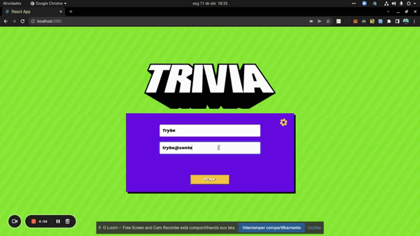

<p align="center">
  
</p>

# Trivia project

# About
This was a collaborative project made by me, [Pedro Tavares](), [Karen Cano](), [Viviane Puga](), [Rosy Mariana]() and [Raynan]() , a fun trivia that challenges the user to answer as many questions as possible in the shortest possible time.

## Technologies and skills

Front-end:
>  React with class components, Redux, CSS3, HTML5, ES6 and API fetching.


## Dependencies

For those who wants to run the project on their machine:
```bash
git clone git@github.com:GabrielFerrariR/Projeto-Trivia.git
cd Projeto-Trivia/src/
npm install
``` 
## Running application
```bash
 npm start
 ``` 

 If you want to see the aplication on web, click [here.]()
